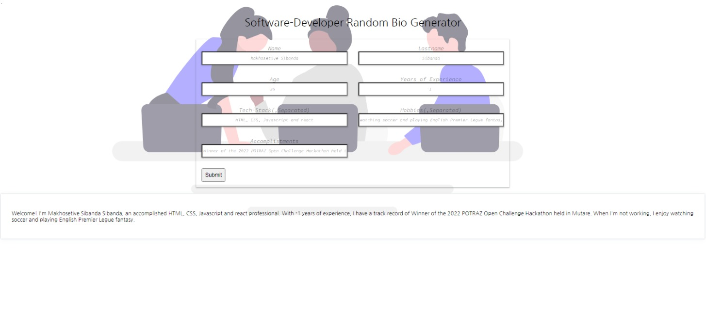

# SoftwareDeveloper-Random-Bio-Generator
# Name: **Makhosetive Sibanda**

## Project image

This project is a software developer random bio generator developed using vanilla JavaScript, HTML, and CSS3. The main goal of this project was to revisit and revise the fundamentals of JavaScript while also creating a fun and interactive tool.

## How it Works

1. The user is required to fill in the necessary details in the input fields.
2. Once the user submits the form, the application generates a software developer bio with the provided details.
3. The generated bio includes information such as name, experience, skills, education, and contact details.

## Features

- Simple and intuitive user interface.
- Randomly generates a software developer bio based on the user's input.
- Provides a quick and easy way to generate a personalized bio for software developers.

## Technologies Used

- Vanilla JavaScript: Used for the logic and functionality of the application.
- HTML: Used for creating the structure and layout of the user interface.
- CSS3: Used for styling and enhancing the visual appearance of the application.

## Getting Started

1. Clone the repository: `https://github.com/Makhosetive7/SoftwareDeveloper-Random-Bio-Generator.git`
2. Open the project in your preferred code editor.
3. Open the `index.html` file in a web browser.
4. Fill in the necessary details in the input fields.
5. Click the "Generate Bio" button to generate a software developer bio.

Feel free to explore and customize the project to suit your needs. Contributions and suggestions are welcome!

## License

This project is licensed under the [MIT License](https://opensource.org/licenses/MIT).
